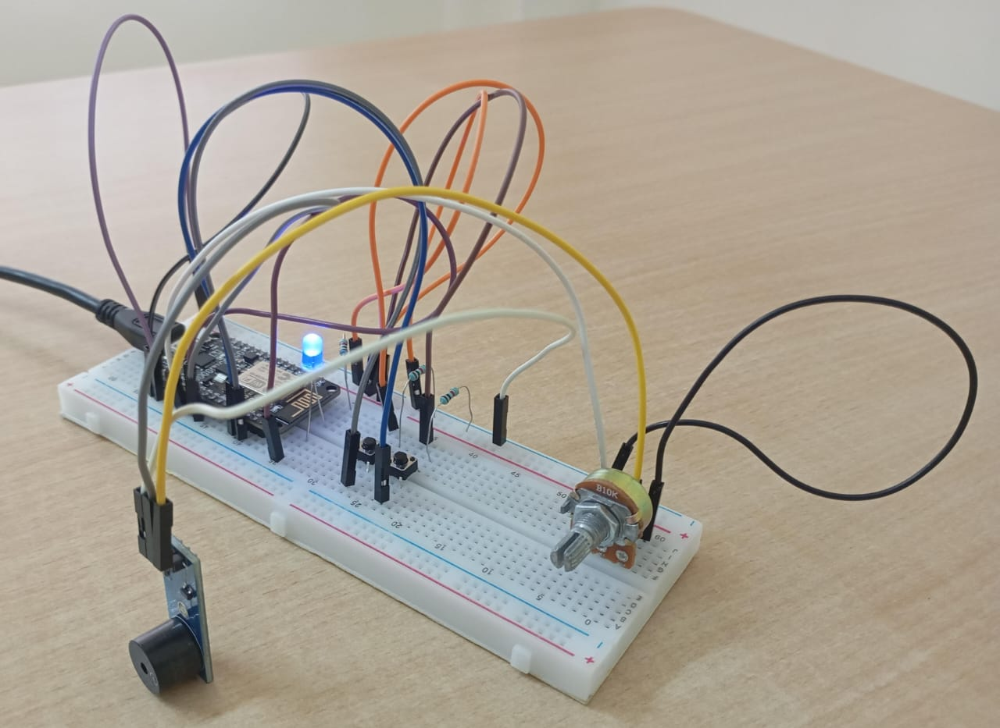
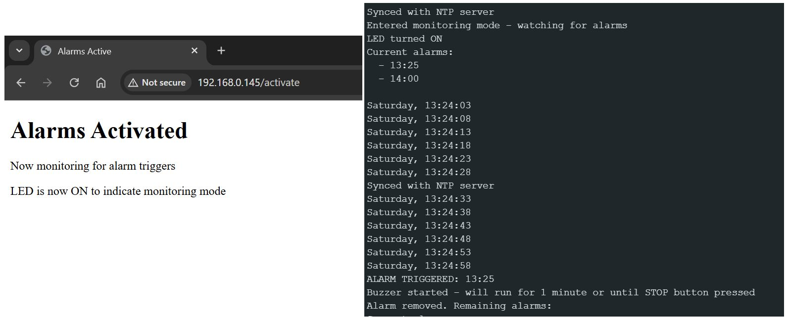

Let's implement a local time server using the Network Time Protocol. We'll then use the time server for an example embedded application.

## What is NTP?

Clocks (oscillators) on most of today's devices aren't good enough for keeping accurate time for very long. They will eventually drift a significant amount. NTP synchronizes clocks in a hierarchical manner to within a few milliseconds of precision. It's implemented in layers, where each layer is known as a stratum. 

Stratum 0 consists of high accuracy time keeping devices such as atomic clocks, GNSS and PTP synchronized clocks. Clocks on lower strata consult their respective reference clocks on higher strata for time synchronization. They also peer with clocks on the same stratum for sanity check and backup. 

Some embedded applications aren't capable of keeping time when powered off, so we also use NTP to "load" the time initially. NTP is accessed through UDP port 123.


_Schematic illustrating NTP_

##  Implementing the time server

The NodeMCU ESP 8266 board is convinient for connecting to networks easily as it has inbuilt WiFi. It is set up in the STA (station) mode. In this mode the ESP connected to an existing WiFi network. 

```cpp
const char* ssid     = "your_ssid";
const char* password = "your_password";
```
{: .nolineno }

The internal clock won't drift much in short time intervals. So we will only use NTP every 30 seconds.

```cpp
const long utcOffsetInSeconds = 19800; // UTC+5:30
const unsigned long syncInterval = 30000; // Sync with NTP server every 30 seconds
WiFiUDP ntpUDP;
NTPClient timeClient(ntpUDP, "asia.pool.ntp.org", utcOffsetInSeconds);
```
{: .nolineno }

The following variables are kept for internal timekeeping

```cpp
unsigned long lastSyncTime = 0;      // When we last synced with NTP server
unsigned long lastUpdateTime = 0;    // When we last updated our internal time
unsigned long currentEpochTime = 0;  // Our current time in epoch seconds
```
{: .nolineno }

```syncWithNTP()``` syncs with the NTP server

```cpp
void syncWithNTP() {
  timeClient.update();
  currentEpochTime = timeClient.getEpochTime();
  lastSyncTime = millis();
  lastUpdateTime = millis();
  Serial.println("Synced with NTP server");
}
```
{: .nolineno }

And ```updateInternalTime()``` keeps time between NTP syncs. To make our software work for cases when the system is required to stay online for a longer duration we also need to handle the overflow of ```millis()```

```cpp
void updateInternalTime() {
  unsigned long currentMillis = millis();
  
  // Handle millis() overflow (happens every ~49 days)
  if (currentMillis < lastUpdateTime) {
    lastUpdateTime = currentMillis;
    lastSyncTime = currentMillis;
  }
  
  // Add elapsed seconds to our epoch time
  unsigned long elapsedSeconds = (currentMillis - lastUpdateTime) / 1000;
  if (elapsedSeconds > 0) {
    currentEpochTime += elapsedSeconds;
    lastUpdateTime = currentMillis;
  }
}
```
{: .nolineno }

To get the time components from epoch we use ```getCurrentTime```

```cpp
void getCurrentTime(int& hour, int& minute, int& second) {
  // Calculate time components from epoch
  unsigned long rawTime = currentEpochTime % 86400; // Seconds in a day
  hour = (rawTime % 86400L) / 3600;
  minute = (rawTime % 3600) / 60;
  second = rawTime % 60;
}
```
{: .nolineno }

## Using the time server for a simple alarm

A simple alarm clock is used as an example embedded application. To make this project a little more fancy, we will set up the NodeMCU to be a web server. The server is hosted on the same IP address (assigned by DHCP in the beginning when it connected to the subnet) .

The HTML and response handles are trivial so we won't discuss them here. The integration of NTP in our alarm system is more interesting.

When the alarm is in ACTIVE mode, the time is printed every 5 seconds in the serial monitor for convinience. 

```cpp
void printCurrentTime() {
    int hour, minute, second;
    getCurrentTime(hour, minute, second);
    
    // Calculate day of week (epoch starts on Thursday = 4)
    int dayOfWeek = ((currentEpochTime / 86400L) + 4) % 7;
    
    Serial.print(daysOfTheWeek[dayOfWeek]);
    Serial.print(", ");
    Serial.print(hour);
    Serial.print(":");
    if (minute < 10) Serial.print("0");
    Serial.print(minute);
    Serial.print(":");
    if (second < 10) Serial.print("0");
    Serial.println(second);
}
```
{: .nolineno }

And the logic for checking if any alarm is triggered is accomplished by the following code.

```cpp
bool isAlarmTime(const Alarm& alarm) {
    int currentHour, currentMinute, currentSecond;
    getCurrentTime(currentHour, currentMinute, currentSecond);
    
    return (currentHour == alarm.hour && currentMinute == alarm.minute);
}
```
{: .nolineno }

## Adding functionality

To make our system a more interactive let's add some neat features.

* an ```LED_PIN``` to indicate the system is currently in the alarm monitering mode. 
* A buzzer that plays a sequence of annoying tones to really give it character :D
    * ```BUZZER_CONTROL_PIN``` turns the buzzer ON/OFF
    * ```BUZZER_SOUND_PIN``` controls the tune (frequency)
* Buttons to interact with the system
    * ```EXIT_BUTTON_PIN``` to manually exit monitering mode.
    * ```STOP_BUTTON_PIN``` to stop the buzzer when alarm fires.

> A potentiometer can be connected to the buzzer to control the volume.
{: .prompt-info }


_Wiring diagram. Red switch: manual override, green switch: stop buzzer and yellow line controls buzzer tone._



_Circuit with all components connected_

## The system in action

Below are some images of the system in action. 


_Connecting to network. IP assigned_


_Setting alarms through web interface_


_Operating in active monitering mode_