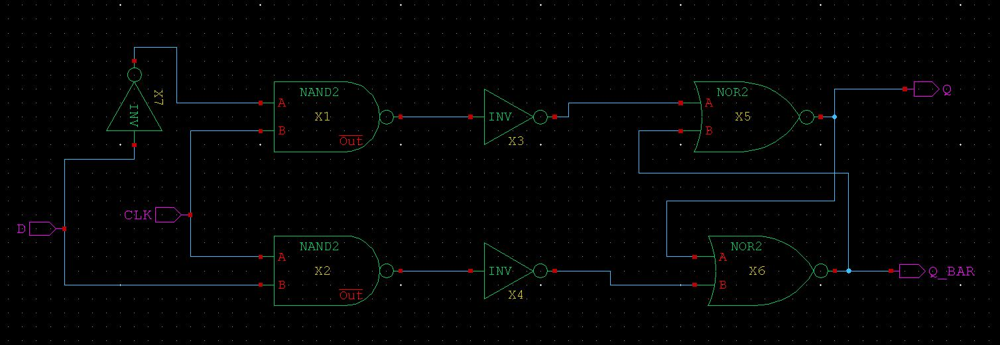
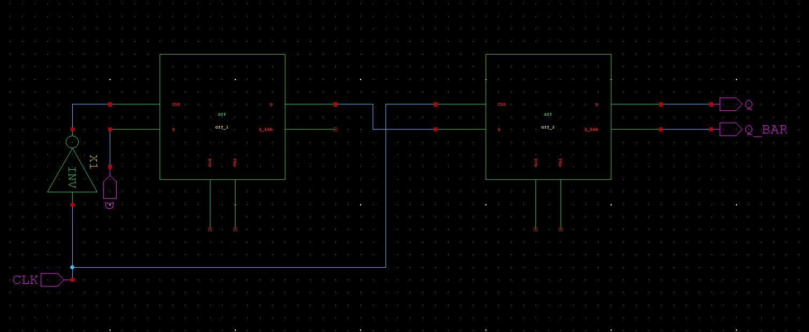
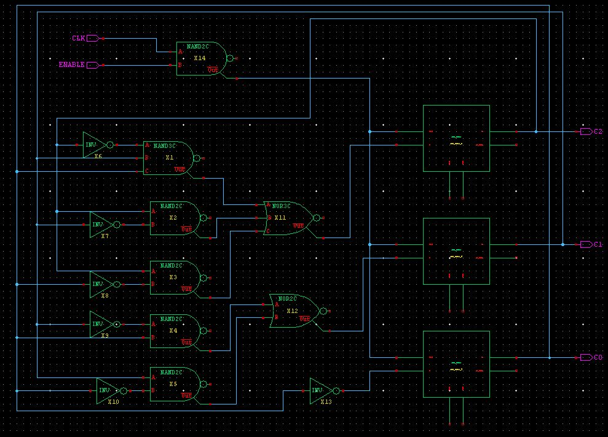
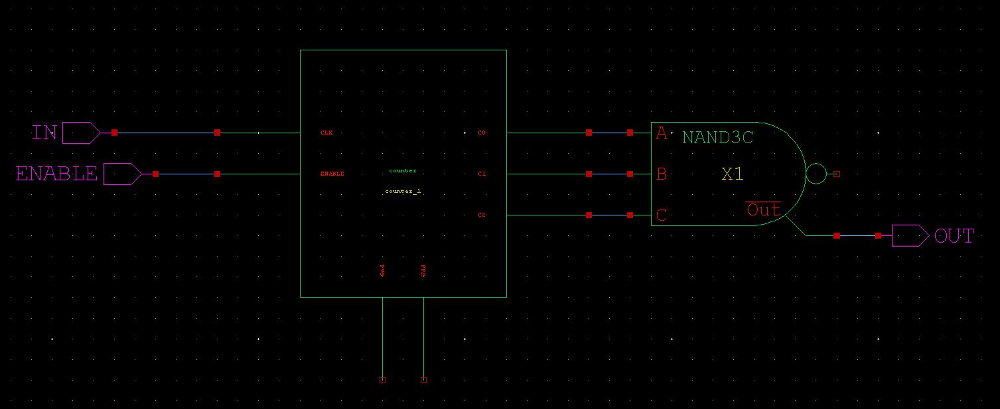
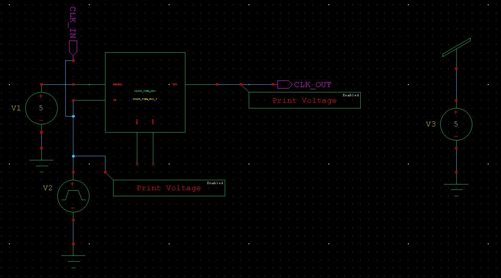
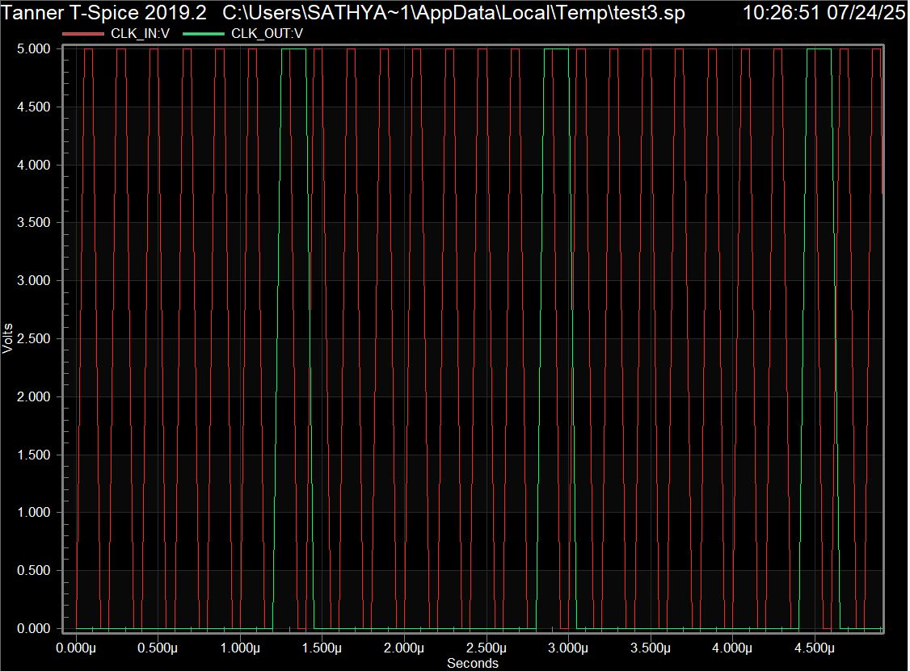

# Background

Most digital systems need several (or even dozens of) different clock signals to drive different subsystems. It would be too expensive to use separate external oscillator circuits to create so many different clock signals, so systems typically produce the clocks they need from just one or two main clock inputs. 

A clock divider circuit creates lower frequency clock signals from an input clock source. The divider circuit counts input clock cycles, and drives the output clock low and then high for some number of input clock cycles.

# Designing the circuit

The circuit is designed hierarchically. So we should start with building the base components first.

## D Latch

The D Latch is used for storing a single bit of data. It stores data given to its input port when the CLOCK is HIGH. It retains this data when the CLOCK is LOW.

_D Latch_

## D flip flop

To convert the level triggered D Latch circuit to an edge triggered D flip flop (DFF), the master slave configuration is used.
This circuit stores data given to its input port when the CLOCK transitions from LOW to HIGH.

_D flip flop_

## 8 bit UP counter

3 DFFs are used to implement an 8 bit UP counter. The counter is also given an ENABLE port.

_8 bit UP counter_

## CLOCK frequency divider

The counter recieves as its input the main CLOCK, and its outputs are fed to a NAND gate. The output is hence HIGH only when all three bits of the counter are LOW. This happens once every 8 cycles. This circuit therefore divides the frequency of the main CLOCK signal by a factor of eight. We can realize any (power of 2) divider this way.

_8 bit UP counter_

# Result

_Test circuit with clock signal and frequency divider_

When this circuit is run, we get the following waveforms.

_Output and input waveforms_

This graph shows the INPUT and OUTPUT waveforms in red and green respectively. It is clearly seen the output is triggered every 8 clock cycles. The circuit this works as intended.